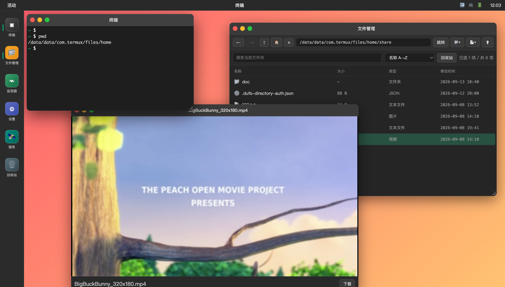

# Termux Web Desktop

在浏览器中模拟 Ubuntu 桌面，终端命令实际在 Termux 中执行，文件管理操作真实文件系统。



## 功能

- **终端**：基于 xterm.js + WebSocket + PTY，真实执行 Termux 命令
- **文件管理**：浏览、新建、删除（回收站）、重命名、复制、移动、上传、下载、文本编辑、媒体预览
- **活动监视器**：只读查看整机 CPU/内存/存储/网络/温度/电池与 Termux 可见进程
- **设置**：主题色 / 壁纸切换（本地持久化）、当前会话与退出登录、设备与服务信息
- **服务管理**：白名单式管理 Termux 常驻服务（dufs / sshd 等），一键启动 / 停止 / 重启，实时状态
- **桌面环境**：Ubuntu 风格，可拖拽/缩放/最小化/最大化窗口，左侧 Dock

## 安装与运行

### 方式一：启动脚本（推荐）

```bash
chmod +x start.sh
./start.sh
```

### 方式二：手动

```bash
pkg install python
pip install flask flask-socketio
python3 server.py
```

启动后在浏览器访问：
- 手机本机：`http://localhost:5000`
- 同局域网电脑：`http://<手机IP>:5000`

## 后台保活

```bash
# 防止 CPU 休眠
termux-wake-lock

# 关闭电池优化（Android 设置中操作）
# 设置 → 应用 → Termux → 电池 → 无限制
```

## 项目结构

```
termux-web-desktop/
├── server.py              # Flask 后端（PTY + 文件 API + 系统指标/信息 + 日志轮转）
├── requirements.txt
├── start.sh               # 首次安装：装依赖 + 交互式生成登录凭据 auth.env
├── run.sh                 # 运行管理：后台 start / stop / restart / status（写 PID + 日志）
├── auth.env.example       # 凭据模板（复制为 auth.env 并填入真实值）
└── static/
    ├── index.html         # 桌面主页面
    ├── css/style.css      # Ubuntu 风格样式（:root 主题变量）
    └── js/
        ├── desktop.js         # 窗口管理系统
        ├── terminal.js        # 终端应用
        ├── filemanager.js     # 文件管理器应用
        ├── activitymonitor.js # 活动监视器应用
        ├── settings.js        # 设置应用（外观/会话/关于）
        ├── services.js        # 服务管理应用（白名单启停）
        └── integration_dufs.js # dufs 集成配置页（安装 + 可视化配置）
```

## 登录鉴权

推荐直接运行 `./start.sh`，它会交互式地询问用户名/密码，自动生成密码哈希与会话密钥并写入 `auth.env`（权限 600）。

如需手动生成（例如脚本化部署）：

```bash
cp auth.env.example auth.env
# 生成密码哈希
python3 -c "from werkzeug.security import generate_password_hash as g; print(g('你的密码'))"
# 生成会话密钥
python3 -c "import secrets; print(secrets.token_hex(32))"
# 将上面两个值填入 auth.env 的 WEB_PASSWORD_HASH 与 SESSION_SECRET
./run.sh start
```

> `auth.env` 含密钥，已在 `.gitignore` 中忽略，请勿提交或外发。

## 日志

`server.log` 采用轮转策略（默认单文件 2MB、保留 3 份），可用环境变量覆盖：
`LOG_FILE` / `LOG_MAX_BYTES` / `LOG_BACKUP_COUNT`。

## 服务管理

“服务管理”应用可对**白名单内**的 Termux 常驻服务执行启动 / 停止 / 重启。
白名单定义在项目根目录的 `services.json`（首次运行自动生成，各设备自行定制，不纳入版本控制）：

```json
[
  { "id": "dufs", "name": "dufs 文件服务", "description": "轻量文件分享",
    "port": 3001, "match": "dufs", "start": "dufs -p 3001 --allow-all ~/share" }
]
```

- `match`：用于 `pgrep -f` 匹配进程的命令行子串
- `port`：用于判断运行状态的监听端口（可选）
- `start`：启动命令（留空则该服务只读，不显示启动按钮）
- `self: true`：标记本 Web 服务自身，只读、禁止通过面板启停（避免自杀）

> 面板仅能操作白名单内服务，不提供任意进程管理，安全可控。

## dufs 集成（文件服务）

在“服务管理”中点击 dufs 卡片的 **配置** 按钮，打开可视化集成配置页。适合把本项目分发给其它用户后，让他们**从零部署并按需配置** dufs：

- **一键安装**：检测本机是否已装 dufs；未装时从源码仓库用 `cargo` 编译安装（进度实时显示、后台进行）。
  - **依赖自动补齐**：点击安装时会自动执行 `pkg install -y rust git` 安装编译依赖（Termux 的 `rust` 包已包含 clang/lld/openssl/zlib），**干净的 Termux 环境也能一键部署，无需手动准备工具链**。
  - dufs 使用纯 Rust 的 rustls，不依赖系统 OpenSSL/C 库额外配置。
  - 安装源可用环境变量覆盖：`DUFS_REPO`（默认 `https://github.com/gengwenguan/dufs`）、`DUFS_BRANCH`（默认 `main`）
  - 首次编译在手机上较慢（可能十几分钟），期间可关闭窗口，安装在后台继续。
- **可视化配置**：共享目录、端口、绑定地址、权限模式（只读 / 上传 / 上传+删除 / 完全控制 / 自定义细粒度）、
  访问密码（`--auth`）、**每目录独立 URL 密码（fork 特色 `--directory-auth`）**、SPA、CORS、HTTPS(TLS) 等，
  并**实时预览生成的启动命令**。
- 提供“局域网只读 / 带密码可上传 / 每目录独立密码 / 完全控制”等**预设方案**一键套用。
- 保存后配置写入 `dufs.json`，并自动同步为服务白名单里的 dufs 启动命令；“保存并启动”可直接拉起。

> `dufs.json` 为设备本地配置，不纳入版本控制。

## 注意事项

- 终端使用 CDN 加载 xterm.js，首次运行需要联网
- 服务默认监听 `0.0.0.0:5000`，局域网内任何人都可访问，请勿在公共网络暴露
- 文件管理操作的是 Termux 真实文件系统，删除操作不可恢复
